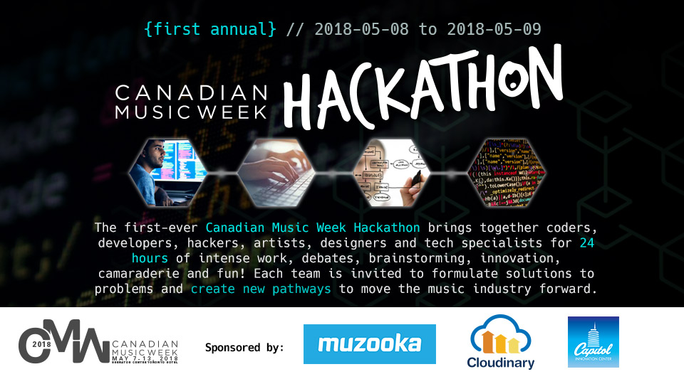

# About

The first-ever Canadian Music Week Hackathon brings together coders, developers, hackers, artists, designers and tech specialists for 24 hours of intense work, debates, brainstorming, innovation, camaraderie and fun! Each team is invited to formulate solutions to problems and create new pathways to move the music industry forward.

As part of theTech and Innovation Summit, the CMW Hackathon will feature the best engineering minds competing to create innovative tech solutions to challenges within the Canadian music business.

After the 24 hours, teams will demo their creations to a group of industry judges and the top winners will then present their hacks on May 9 to an audience at Canadian Music Week, where the final prizes will be awarded.

Our host and facilitator is Travis Laurendine, who has run multiple Hackathons for SXSW, Outside Lands, Bonnaroo, The Super Bowl and many others.

Judges include Jay Rosenzweig \(CEO of Rosenzweig & Co.\),Jodi Kovitz \(Founder & CEO of \#MoveTheDial\), Shawn Wilson \(CEO of Muzooka\), Greg Nisbet \(Founder & CEO of MEDIAZOIC\), David Dufresne, Partner at Panache Ventures, Roger Chabra, CIO of TribalScale.

Muzooka, where artists and their teams manage digital assets across multiple platforms from a central hub, will be providing their API for the hackers to incorporate into their tech creations.

Hackers can submit applications here through May 5

Hackathon Location:   
Brainsights 70 Peter St., Suite B01

Hackathon Winners Presentations and Awards:   
March 9, 4:10-5:00pm.   
Sheraton Centre Hotel \(CMW HQ\), Hall C

